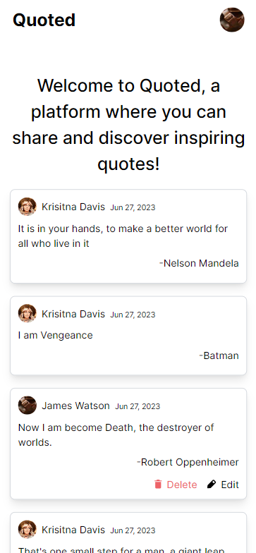
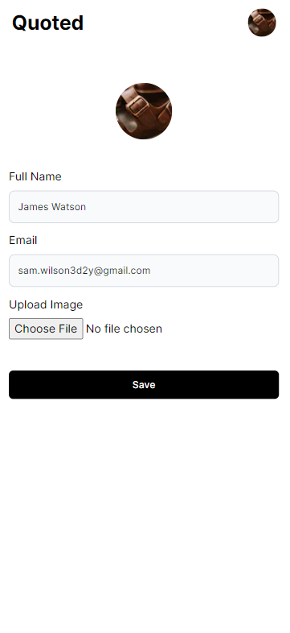
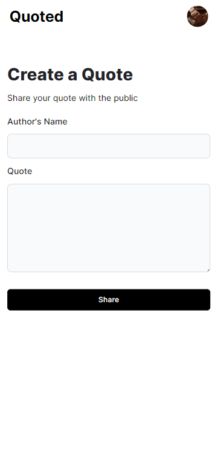
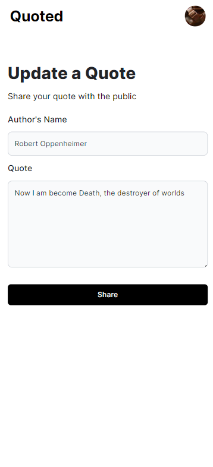

# Quoted

## Getting Started

First, run the development server:

```bash
npm run dev
# or
yarn dev
# or
pnpm dev
```

## Table of contents

- [Overview](#overview)
  - [The challenge](#the-challenge)
  - [Screenshot](#screenshot)
  - [Links](#links)
- [My process](#my-process)
  - [Built with](#built-with)
  - [What I learned](#what-i-learned)

## Overview

### The challenge
- Quoted is a web application that allows to create an account and use the account to perform this tasks:
    - Add quotes
    - Edit/ Delete quotes that they created
    - Edit their profile basic information and upload profile picture
    - Display all the quotes created by every user on the homepage 
- A quote should have the following details:
    - The Quote
    - Name of the Author of the quote
    - when the quote was posted
    - profile picture and name of the user who posted the quote
    - an Edit and a Delete button avaliable only post owners
- Users will Sign in using "Google" and the default profile picture will be their google account picture

### Screenshot

Home page




Profile page




Create quote page




Update quote page




### Links

- Live Site URL: [quoted-nnzx.vercel.app](https://quoted-nnzx.vercel.app/)

## My process

### Built with

- [Next.js](https://nextjs.org/) - React framework
- Firebase google Authentication
- firestore
- tailwind css
- Mobile-first workflow
- Flexbox


### What I learned

This project expanded my knowledge in various areas. I gained valuable insights into effectively integrating Firestore, Storage, and Firebase Authentication in a single project, as well as successfully deploying it to Vercel. Moreover, I appreciated delving into Next.js, which offers a unique approach bit distinct from React.js. Noteworthy aspects of Next.js include the flexibility to choose server-side or client-side rendering for components, the built-in inclusion of Tailwind CSS without the need for manual configuration, and the convenient routing capability without the requirement of installing an additional package. This project not only broadened my skill set but also reinforced the power and advantages Next.js brings to future endeavors.


